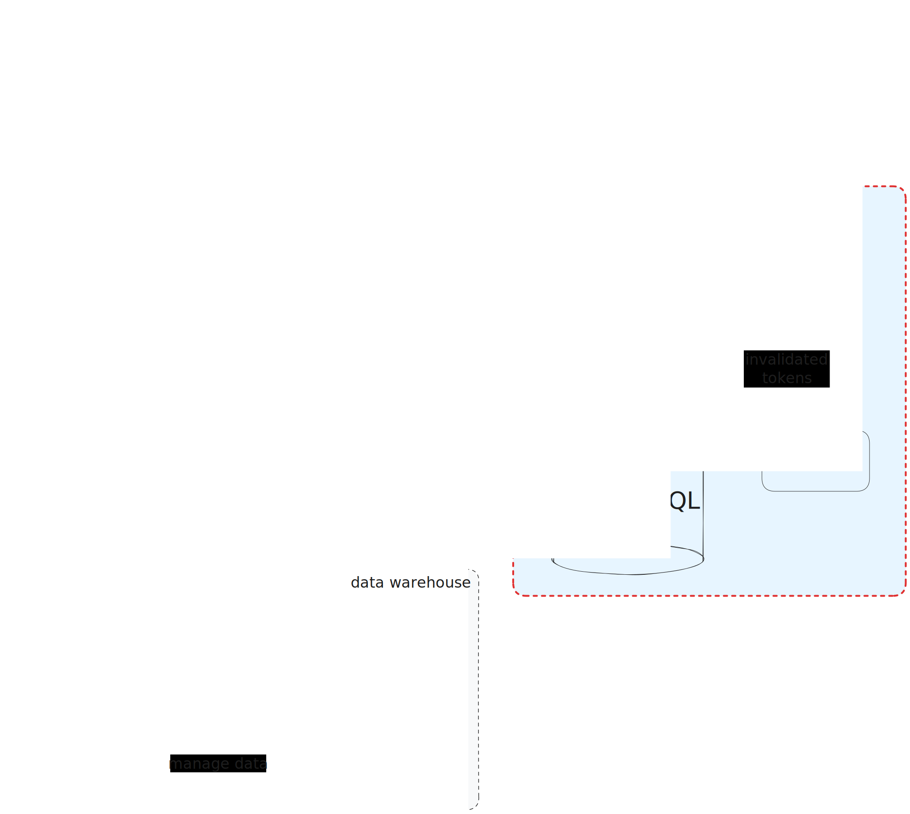

# Authentication Service

## Core Stack

- FastAPI
- PostgreSQL
- Redis

## About

The project follows a microservice architecture. This particular service _(Authentication Service)_ is responsible for implementing API endpoints for authentication.

**The Auth Service** can be used to authenticate users in our other services, e.g. one of them is the [Movies Service](https://github.com/vogelfenx/movies-service-api). Authentication is based on `JWT` tokens, so the client application can authenticate a user by obtaining a JWT token to provide to other services. Meanwhile, a service can validate the provided JWT token using a shared secret with the authentication service. This approach allows the service to authenticate users without having to interact with the authentication service each time.

**The Auth service** uses `Redis` as an in-memory database to invalidate used JWT `Refresh Tokens`. In-memory database allows to reduce the performance impact by querying data, and such functionality as the expiration time of a record allows simple mechanisms to keep the database up to date.

**Services interaction scheme:**



## Installation & Launching

1. Launch prod docker-compose:

   ```bash
      docker-compose -f docker-compose.yml up --build
   ```

1. Create `superuser` with the role `admin`:

   ```bash
   docker exec auth_api_service python src/manage.py createadmin superuser_name superuser_pwd
   ```

1. Test the API using OpenAPI interface: `http://127.0.0.1:80/api/openapi/`

## Development

1. For development use debug docker-compose:

   ```
      docker-compose -f docker-compose.debug.yml up --build
   ```

1. Test the API using OpenAPI interface: `http://127.0.0.1:8000/api/openapi/`
